# 班级甘特图 · 数据源（北交大 2026 级软工两年制专硕 · 入学到毕业）

> ⚠️ 说明：下面 ```` ```mermaid ```` 代码块是**唯一时间线数据源**。线上渲染页（index.html）
> 会自动提取本代码块并用内置渲染器绘制成交互式甘特图（支持年/月切换、回到今天、放大缩小、
> 点击任务查看详情）。
> 想新增任务：复制一行任务语法追加到对应 `section` 即可，保存后 push，全班刷新即见。
>
> - 任务语法：`任务名 : 状态, id, 开始日期, 结束日期`；里程碑写法：`任务名 :milestone, id, 日期, 0d`
> - 状态可选：`done` 已完成 / `active` 进行中 / `crit` 关键节点（也可组合）
> - `id`（a1/b1/t1/m1/k1…）用于「点击任务 → 弹详情」，详情数据见 `js/events.js`，请保持 id 稳定
> - 详情文案来自班级通知（表二·班群通知表），后续事务更新请在 js/events.js 里同步维护
> - `section 课程表(…)` 是**本学期课表**：每门课按「星期几 + 节次」入库后，**再按教学周逐日拆开**，
>   每个具体上课日一条（id 形如 `k1w09`＝课程 k1 的第 09 教学周；基础库 `k1…k12` 见 `js/events.js`），
>   条目的开始/结束即该真诶时段的起止（精确到分钟）。`2026-09-07` 为第 1 教学周周一，
>   第 N 教学周的周X = 9.7 + (N−1)×7 + 星期X偏移 天。
> - 课程表条目**不进入**待办提醒链路（`deadlines.json` / `deadlines.ics` / 页面「🔔 提醒」）——
>   周期性上课不是「截止待办」。过滤口径：section 名含「课程表」，见 `tools/build-deadlines.js`
>   与 `js/viewer.js` 的 `isCourseTask()`；两处必须同时改。

```mermaid
gantt
    title 北京交通大学2026级软件工程两年制专硕关键节点(2026年8月至2028年7月)
    dateFormat YYYY-MM-DD HH:mm
    axisFormat %Y-%m
    section 入学前准备
    收体检表 :b1, 2026-09-05, 2026-09-07
    校外住宿登记承诺书(纸质版）提交 :b3, 2026-09-13, 0d
    “北京交通大学研究生学生登记表”(电子版+纸质)提交 :b4, 2026-09-13, 0d
    提交《放弃困难认定声明书》（纸质版） :b5, 2026-09-06, 0d
    户口迁移证提交 :b2, 2026-09-09, 0d
    交学费 :b6, 2026-08-25, 2026-09-09
    去天佑会堂经管牌子集合看直播，13.15到 :milestone, m12, 2026-09-10 13:00, 2026-09-10 13:00
    文艺汇演领票 :t25, 2026-09-10 14:00, 2026-09-10 17:00
    交大人节”文艺晚会 :milestone, b7, 2026-09-10 18:35, 2026-09-10 18:45
    section 报到与注册
    section 开学季事务(班级通知)
    section 第一学期(2026秋)
    秋季学期教学(9.7至次年1.17) :t7, 2026-09-07, 2027-01-17
    元旦(2027.1.1) :milestone, m7, 2027-01-01, 0d
    期末考试周(1月上中旬,推测) :crit, t8, 2027-01-04, 2027-01-15
    section 课程表(2026秋季学期,第1教学周自9.7起,已按教学周逐日拆发)
    数据科学与知识工程(周二·11.03 08:00-09:50 YF305) :k1w09, 2026-11-03 08:00, 2026-11-03 09:50
    数据科学与知识工程(周二·11.10 08:00-09:50 YF305) :k1w10, 2026-11-10 08:00, 2026-11-10 09:50
    数据科学与知识工程(周二·11.17 08:00-09:50 YF305) :k1w11, 2026-11-17 08:00, 2026-11-17 09:50
    数据科学与知识工程(周二·11.24 08:00-09:50 YF305) :k1w12, 2026-11-24 08:00, 2026-11-24 09:50
    数据科学与知识工程(周二·12.01 08:00-09:50 YF305) :k1w13, 2026-12-01 08:00, 2026-12-01 09:50
    数据科学与知识工程(周二·12.08 08:00-09:50 YF305) :k1w14, 2026-12-08 08:00, 2026-12-08 09:50
    数据科学与知识工程(周二·12.15 08:00-09:50 YF305) :k1w15, 2026-12-15 08:00, 2026-12-15 09:50
    数据科学与知识工程(周二·12.22 08:00-09:50 YF305) :k1w16, 2026-12-22 08:00, 2026-12-22 09:50
    数据科学与知识工程(周三·11.04 19:00-20:50 YF305) :k2w09, 2026-11-04 19:00, 2026-11-04 20:50
    数据科学与知识工程(周三·11.11 19:00-20:50 YF305) :k2w10, 2026-11-11 19:00, 2026-11-11 20:50
    数据科学与知识工程(周三·11.18 19:00-20:50 YF305) :k2w11, 2026-11-18 19:00, 2026-11-18 20:50
    数据科学与知识工程(周三·11.25 19:00-20:50 YF305) :k2w12, 2026-11-25 19:00, 2026-11-25 20:50
    数据科学与知识工程(周三·12.02 19:00-20:50 YF305) :k2w13, 2026-12-02 19:00, 2026-12-02 20:50
    数据科学与知识工程(周三·12.09 19:00-20:50 YF305) :k2w14, 2026-12-09 19:00, 2026-12-09 20:50
    数据科学与知识工程(周三·12.16 19:00-20:50 YF305) :k2w15, 2026-12-16 19:00, 2026-12-16 20:50
    数据科学与知识工程(周三·12.23 19:00-20:50 YF305) :k2w16, 2026-12-23 19:00, 2026-12-23 20:50
    网络计算与边缘智能(周四·09.10 08:00-09:50 SY309) :k3w01, 2026-09-10 08:00, 2026-09-10 09:50
    网络计算与边缘智能(周四·09.17 08:00-09:50 SY309) :k3w02, 2026-09-17 08:00, 2026-09-17 09:50
    网络计算与边缘智能(周四·09.24 08:00-09:50 SY309) :k3w03, 2026-09-24 08:00, 2026-09-24 09:50
    网络计算与边缘智能(周四·10.01 08:00-09:50 SY309) :k3w04, 2026-10-01 08:00, 2026-10-01 09:50
    网络计算与边缘智能(周四·10.08 08:00-09:50 SY309) :k3w05, 2026-10-08 08:00, 2026-10-08 09:50
    网络计算与边缘智能(周四·10.15 08:00-09:50 SY309) :k3w06, 2026-10-15 08:00, 2026-10-15 09:50
    网络计算与边缘智能(周四·10.22 08:00-09:50 SY309) :k3w07, 2026-10-22 08:00, 2026-10-22 09:50
    网络计算与边缘智能(周四·10.29 08:00-09:50 SY309) :k3w08, 2026-10-29 08:00, 2026-10-29 09:50
    网络计算与边缘智能(周四·11.05 08:00-09:50 SY309) :k3w09, 2026-11-05 08:00, 2026-11-05 09:50
    网络计算与边缘智能(周四·11.12 08:00-09:50 SY309) :k3w10, 2026-11-12 08:00, 2026-11-12 09:50
    网络计算与边缘智能(周四·11.19 08:00-09:50 SY309) :k3w11, 2026-11-19 08:00, 2026-11-19 09:50
    网络计算与边缘智能(周四·11.26 08:00-09:50 SY309) :k3w12, 2026-11-26 08:00, 2026-11-26 09:50
    网络计算与边缘智能(周四·12.03 08:00-09:50 SY309) :k3w13, 2026-12-03 08:00, 2026-12-03 09:50
    网络计算与边缘智能(周四·12.10 08:00-09:50 SY309) :k3w14, 2026-12-10 08:00, 2026-12-10 09:50
    网络计算与边缘智能(周四·12.17 08:00-09:50 SY309) :k3w15, 2026-12-17 08:00, 2026-12-17 09:50
    网络计算与边缘智能(周四·12.24 08:00-09:50 SY309) :k3w16, 2026-12-24 08:00, 2026-12-24 09:50
    学术写作能力(周五·09.11 08:00-09:50 东区DQ505) :k4w01, 2026-09-11 08:00, 2026-09-11 09:50
    学术写作能力(周五·09.18 08:00-09:50 东区DQ505) :k4w02, 2026-09-18 08:00, 2026-09-18 09:50
    学术写作能力(周五·09.25 08:00-09:50 东区DQ505) :k4w03, 2026-09-25 08:00, 2026-09-25 09:50
    学术写作能力(周五·10.02 08:00-09:50 东区DQ505) :k4w04, 2026-10-02 08:00, 2026-10-02 09:50
    学术写作能力(周五·10.09 08:00-09:50 东区DQ505) :k4w05, 2026-10-09 08:00, 2026-10-09 09:50
    学术写作能力(周五·10.16 08:00-09:50 东区DQ505) :k4w06, 2026-10-16 08:00, 2026-10-16 09:50
    学术写作能力(周五·10.23 08:00-09:50 东区DQ505) :k4w07, 2026-10-23 08:00, 2026-10-23 09:50
    学术写作能力(周五·10.30 08:00-09:50 东区DQ505) :k4w08, 2026-10-30 08:00, 2026-10-30 09:50
    专业英语(周四·09.10 10:10-12:00 YF411) :k5w01, 2026-09-10 10:10, 2026-09-10 12:00
    专业英语(周四·09.17 10:10-12:00 YF411) :k5w02, 2026-09-17 10:10, 2026-09-17 12:00
    专业英语(周四·09.24 10:10-12:00 YF411) :k5w03, 2026-09-24 10:10, 2026-09-24 12:00
    专业英语(周四·10.01 10:10-12:00 YF411) :k5w04, 2026-10-01 10:10, 2026-10-01 12:00
    专业英语(周四·10.08 10:10-12:00 YF411) :k5w05, 2026-10-08 10:10, 2026-10-08 12:00
    专业英语(周四·10.15 10:10-12:00 YF411) :k5w06, 2026-10-15 10:10, 2026-10-15 12:00
    专业英语(周四·10.22 10:10-12:00 YF411) :k5w07, 2026-10-22 10:10, 2026-10-22 12:00
    专业英语(周四·10.29 10:10-12:00 YF411) :k5w08, 2026-10-29 10:10, 2026-10-29 12:00
    专业英语(周四·11.05 10:10-12:00 YF411) :k5w09, 2026-11-05 10:10, 2026-11-05 12:00
    专业英语(周四·11.12 10:10-12:00 YF411) :k5w10, 2026-11-12 10:10, 2026-11-12 12:00
    专业英语(周四·11.19 10:10-12:00 YF411) :k5w11, 2026-11-19 10:10, 2026-11-19 12:00
    专业英语(周四·11.26 10:10-12:00 YF411) :k5w12, 2026-11-26 10:10, 2026-11-26 12:00
    专业英语(周四·12.03 10:10-12:00 YF411) :k5w13, 2026-12-03 10:10, 2026-12-03 12:00
    专业英语(周四·12.10 10:10-12:00 YF411) :k5w14, 2026-12-10 10:10, 2026-12-10 12:00
    专业英语(周四·12.17 10:10-12:00 YF411) :k5w15, 2026-12-17 10:10, 2026-12-17 12:00
    专业英语(周四·12.24 10:10-12:00 YF411) :k5w16, 2026-12-24 10:10, 2026-12-24 12:00
    自然辩证法(周一·10.26 14:10-18:10 SY108) :k6w08, 2026-10-26 14:10, 2026-10-26 18:10
    自然辩证法(周一·11.02 14:10-18:10 SY108) :k6w09, 2026-11-02 14:10, 2026-11-02 18:10
    自然辩证法(周一·11.09 14:10-18:10 SY108) :k6w10, 2026-11-09 14:10, 2026-11-09 18:10
    自然辩证法(周一·11.16 14:10-18:10 SY108) :k6w11, 2026-11-16 14:10, 2026-11-16 18:10
    自然辩证法(周一·11.23 14:10-18:10 SY108) :k6w12, 2026-11-23 14:10, 2026-11-23 18:10
    自然辩证法(周一·11.30 14:10-18:10 SY108) :k6w13, 2026-11-30 14:10, 2026-11-30 18:10
    新时代中特理论与实践(周五·09.11 14:10-18:10 YF406) :k7w01, 2026-09-11 14:10, 2026-09-11 18:10
    新时代中特理论与实践(周五·09.18 14:10-18:10 YF406) :k7w02, 2026-09-18 14:10, 2026-09-18 18:10
    新时代中特理论与实践(周五·09.25 14:10-18:10 YF406) :k7w03, 2026-09-25 14:10, 2026-09-25 18:10
    新时代中特理论与实践(周五·10.02 14:10-18:10 YF406) :k7w04, 2026-10-02 14:10, 2026-10-02 18:10
    新时代中特理论与实践(周五·10.09 14:10-18:10 YF406) :k7w05, 2026-10-09 14:10, 2026-10-09 18:10
    新时代中特理论与实践(周五·10.16 14:10-18:10 YF406) :k7w06, 2026-10-16 14:10, 2026-10-16 18:10
    新时代中特理论与实践(周五·10.23 14:10-18:10 YF406) :k7w07, 2026-10-23 14:10, 2026-10-23 18:10
    新时代中特理论与实践(周五·10.30 14:10-18:10 YF406) :k7w08, 2026-10-30 14:10, 2026-10-30 18:10
    新时代中特理论与实践(周五·11.06 14:10-18:10 YF406) :k7w09, 2026-11-06 14:10, 2026-11-06 18:10
    新时代中特理论与实践(周五·11.13 14:10-18:10 YF406) :k7w10, 2026-11-13 14:10, 2026-11-13 18:10
    新时代中特理论与实践(周五·11.20 14:10-18:10 YF406) :k7w11, 2026-11-20 14:10, 2026-11-20 18:10
    新时代中特理论与实践(周五·11.27 14:10-18:10 YF406) :k7w12, 2026-11-27 14:10, 2026-11-27 18:10
    数值分析I(周三·09.09 16:20-18:10 SY108) :k8w01, 2026-09-09 16:20, 2026-09-09 18:10
    数值分析I(周三·09.16 16:20-18:10 SY108) :k8w02, 2026-09-16 16:20, 2026-09-16 18:10
    数值分析I(周三·09.23 16:20-18:10 SY108) :k8w03, 2026-09-23 16:20, 2026-09-23 18:10
    数值分析I(周三·09.30 16:20-18:10 SY108) :k8w04, 2026-09-30 16:20, 2026-09-30 18:10
    数值分析I(周三·10.07 16:20-18:10 SY108) :k8w05, 2026-10-07 16:20, 2026-10-07 18:10
    数值分析I(周三·10.14 16:20-18:10 SY108) :k8w06, 2026-10-14 16:20, 2026-10-14 18:10
    数值分析I(周三·10.21 16:20-18:10 SY108) :k8w07, 2026-10-21 16:20, 2026-10-21 18:10
    数值分析I(周三·10.28 16:20-18:10 SY108) :k8w08, 2026-10-28 16:20, 2026-10-28 18:10
    数值分析I(周三·11.04 16:20-18:10 SY108) :k8w09, 2026-11-04 16:20, 2026-11-04 18:10
    数值分析I(周三·11.11 16:20-18:10 SY108) :k8w10, 2026-11-11 16:20, 2026-11-11 18:10
    数值分析I(周三·11.18 16:20-18:10 SY108) :k8w11, 2026-11-18 16:20, 2026-11-18 18:10
    数值分析I(周三·11.25 16:20-18:10 SY108) :k8w12, 2026-11-25 16:20, 2026-11-25 18:10
    数值分析I(周三·12.02 16:20-18:10 SY108) :k8w13, 2026-12-02 16:20, 2026-12-02 18:10
    数值分析I(周三·12.09 16:20-18:10 SY108) :k8w14, 2026-12-09 16:20, 2026-12-09 18:10
    数值分析I(周三·12.16 16:20-18:10 SY108) :k8w15, 2026-12-16 16:20, 2026-12-16 18:10
    数值分析I(周三·12.23 16:20-18:10 SY108) :k8w16, 2026-12-23 16:20, 2026-12-23 18:10
    欧拉内核分析(6-7连堂)(周二·09.08 19:00-21:50 东区505) :k9w01, 2026-09-08 19:00, 2026-09-08 21:50
    欧拉内核分析(6-7连堂)(周二·09.15 19:00-21:50 东区505) :k9w02, 2026-09-15 19:00, 2026-09-15 21:50
    欧拉内核分析(6-7连堂)(周二·09.22 19:00-21:50 东区505) :k9w03, 2026-09-22 19:00, 2026-09-22 21:50
    欧拉内核分析(6-7连堂)(周二·09.29 19:00-21:50 东区505) :k9w04, 2026-09-29 19:00, 2026-09-29 21:50
    欧拉内核分析(6-7连堂)(周二·10.06 19:00-21:50 东区505) :k9w05, 2026-10-06 19:00, 2026-10-06 21:50
    欧拉内核分析(6-7连堂)(周二·10.13 19:00-21:50 东区505) :k9w06, 2026-10-13 19:00, 2026-10-13 21:50
    欧拉内核分析(6-7连堂)(周二·10.20 19:00-21:50 东区505) :k9w07, 2026-10-20 19:00, 2026-10-20 21:50
    欧拉内核分析(6-7连堂)(周二·10.27 19:00-21:50 东区505) :k9w08, 2026-10-27 19:00, 2026-10-27 21:50
    欧拉内核分析(第6节)(周一·11.02 19:00-20:50 东区505) :k10w09, 2026-11-02 19:00, 2026-11-02 20:50
    欧拉内核分析(第6节)(周一·11.09 19:00-20:50 东区505) :k10w10, 2026-11-09 19:00, 2026-11-09 20:50
    欧拉内核分析(第6节)(周一·11.16 19:00-20:50 东区505) :k10w11, 2026-11-16 19:00, 2026-11-16 20:50
    欧拉内核分析(第7节)(周一·11.02 21:00-21:50 东区505) :k11w09, 2026-11-02 21:00, 2026-11-02 21:50
    欧拉内核分析(第7节)(周一·11.09 21:00-21:50 东区505) :k11w10, 2026-11-09 21:00, 2026-11-09 21:50
    知识产权法(周四·09.24 21:00-21:50 雨课堂线上) :k12w03, 2026-09-24 21:00, 2026-09-24 21:50
    知识产权法(周四·10.01 21:00-21:50 雨课堂线上) :k12w04, 2026-10-01 21:00, 2026-10-01 21:50
    知识产权法(周四·10.08 21:00-21:50 雨课堂线上) :k12w05, 2026-10-08 21:00, 2026-10-08 21:50
    知识产权法(周四·10.15 21:00-21:50 雨课堂线上) :k12w06, 2026-10-15 21:00, 2026-10-15 21:50
    知识产权法(周四·10.22 21:00-21:50 雨课堂线上) :k12w07, 2026-10-22 21:00, 2026-10-22 21:50
    知识产权法(周四·10.29 21:00-21:50 雨课堂线上) :k12w08, 2026-10-29 21:00, 2026-10-29 21:50
    知识产权法(周四·11.05 21:00-21:50 雨课堂线上) :k12w09, 2026-11-05 21:00, 2026-11-05 21:50
    知识产权法(周四·11.12 21:00-21:50 雨课堂线上) :k12w10, 2026-11-12 21:00, 2026-11-12 21:50
    知识产权法(周四·11.19 21:00-21:50 雨课堂线上) :k12w11, 2026-11-19 21:00, 2026-11-19 21:50
    知识产权法(周四·11.26 21:00-21:50 雨课堂线上) :k12w12, 2026-11-26 21:00, 2026-11-26 21:50
    知识产权法(周四·12.03 21:00-21:50 雨课堂线上) :k12w13, 2026-12-03 21:00, 2026-12-03 21:50
    section 寒假与第二学期(2027春)
    学生寒假(1.18至2.28) :t9, 2027-01-18, 2027-02-28
    春季报到注册(2.27至2.28) :t10, 2027-02-27, 2027-02-28
    春季学期教学(3.1至6.30) :t11, 2027-03-01, 2027-06-30
    清明节(4.5) :milestone, m8, 2027-04-05, 0d
    劳动节(5.1) :milestone, m9, 2027-05-01, 0d
    运动会停课(5.22至5.23) :t12, 2027-05-22, 2027-05-23
    端午节(6.9) :milestone, m10, 2027-06-09, 0d
    开题报告答辩(第二学期末,6月,推测) :crit, t13, 2027-06-01, 2027-06-30
    section 夏季学期与专业实践
    夏季学期(7.5至9.5) :t14, 2027-07-05, 2027-09-05
    学生暑假(7.26至9.5) :t15, 2027-07-26, 2027-09-05
    专业实践(不少于6个月,7月至12月,推测) :crit, t16, 2027-07-01, 2027-12-31
    section 第三学期(2027秋,推测)
    第三学期教学(约9.6至2028.1.16,推测) :t17, 2027-09-06, 2028-01-16
    中期考核(第三学期末,12月至1月,推测) :crit, t18, 2027-12-01, 2028-01-16
    寒假(约2028.1.17至2.27,推测) :t19, 2028-01-17, 2028-02-27
    section 第四学期(2028春,推测)
    第四学期教学(约2.28至6月中旬,推测) :t20, 2028-02-28, 2028-06-15
    论文撰写与导师审核定稿(3月至4月,推测) :t21, 2028-03-01, 2028-04-30
    学位论文匿名送审/盲审(4月至5月,推测) :crit, t22, 2028-04-01, 2028-05-15
    论文答辩(第四学期末,5月至6月,推测) :crit, t23, 2028-05-16, 2028-06-10
    毕业典礼暨学位授予(6月中旬,推测) :milestone, m11, 2028-06-15, 0d
    离校手续办理(6月下旬至7月,推测) :t24, 2028-06-16, 2028-07-30
```


