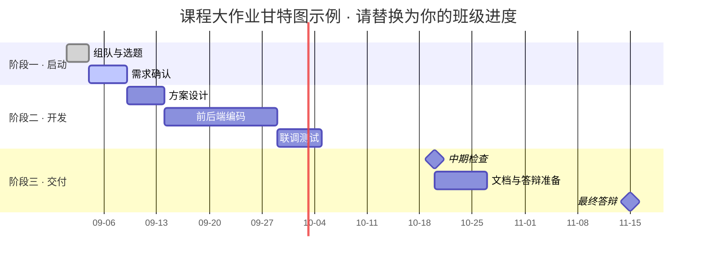

# 班级甘特图 · 数据源

> ⚠️ 说明：下面 ```` ```mermaid ```` 代码块是本页面的唯一数据源。**渲染页只提取这些代码块**，本文件其它文字不影响线上页面。
> 想加第二张图，就在下面再粘贴一个 ```mermaid 代码块即可（每张图会依次显示）。


```mermaid
gantt
    dateFormat YYYY-MM-DD
    title 课程大作业甘特图示例 · 请替换为你的班级进度
    axisFormat %m-%d
    todayMarker stroke-width:2.5px,stroke:#ef4444,opacity:0.85

    section 阶段一 · 启动
        组队与选题          :done,    t1, 2026-09-01, 3d
        需求确认            :active,  t2, 2026-09-04, 5d

    section 阶段二 · 开发
        方案设计            :         t3, after t2, 5d
        前后端编码          :         t4, after t3, 15d
        联调测试            :         t5, after t4, 6d

    section 阶段三 · 交付
        中期检查            :milestone, m1, 2026-10-20, 0d
        文档与答辩准备      :         t6, after m1, 7d
        最终答辩            :milestone, m2, 2026-11-15, 0d
```
